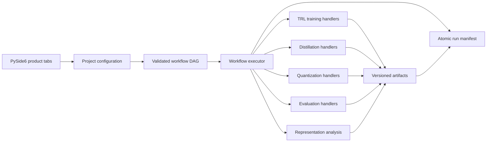

# Architecture

Finetuner separates product configuration from execution. The UI edits typed configurations; a
validated workflow chooses which operations run; stage handlers produce typed artifacts; the manifest
records lineage and status.



## Workflow schema

A workflow has a stable identifier, schema version, and stages. Every stage has an identifier, kind,
dependency list, parameters, and enabled flag. Validation rejects duplicate identifiers, missing or
disabled dependencies, cycles, unsupported stage kinds, and unsupported schema versions.

```json
{
  "schema_version": 1,
  "id": "custom_alignment",
  "name": "Custom alignment",
  "stages": [
    {
      "id": "sft",
      "name": "Instruction tuning",
      "kind": "train",
      "depends_on": [],
      "parameters": {"method": "sft"},
      "enabled": true
    },
    {
      "id": "dpo",
      "name": "Preference tuning",
      "kind": "train",
      "depends_on": ["sft"],
      "parameters": {"method": "dpo", "dpo_beta": 0.1},
      "enabled": true
    },
    {
      "id": "evaluate",
      "name": "Evaluate",
      "kind": "evaluate",
      "depends_on": ["dpo"],
      "parameters": {},
      "enabled": true
    }
  ]
}
```

Stage parameters may override fields from the corresponding typed configuration. Arbitrary keys are
not passed into trainer constructors.

## Artifact contracts

- `policy_model`: an inference-capable policy or adapter produced by training/distillation
- `reward_model`: a scalar reward checkpoint used by PPO-style stages
- `eval_results`: structured benchmark results
- `analysis`: `representations.json` with layer points, metrics, and CKA matrix
- `deployment_model`: a target-specific compressed artifact directory
- `distillation_manifest`: teacher/data-generation provenance

PPO resolves policy and reward artifacts independently, preventing an easy-to-miss error where the
reward checkpoint is accidentally used as the policy. Handlers see only declared direct dependencies.

## Reliability boundaries

- Config, result, analysis, and manifest JSON use atomic replace writes.
- Untrusted model names and repository IDs are converted into collision-resistant, non-traversing path
  components.
- Worker code depends on core model validation, never Qt UI modules.
- Subprocesses use argument arrays with `shell=False`; workflow parameters are never interpolated into
  shell strings.
- Cancellation is checked at stage boundaries. Trainer-level cooperative cancellation and resumable
  distributed checkpoints remain future work.
- Run manifests are local provenance records, not a substitute for an external experiment tracker,
  artifact registry, access-control service, or audit-log sink.
