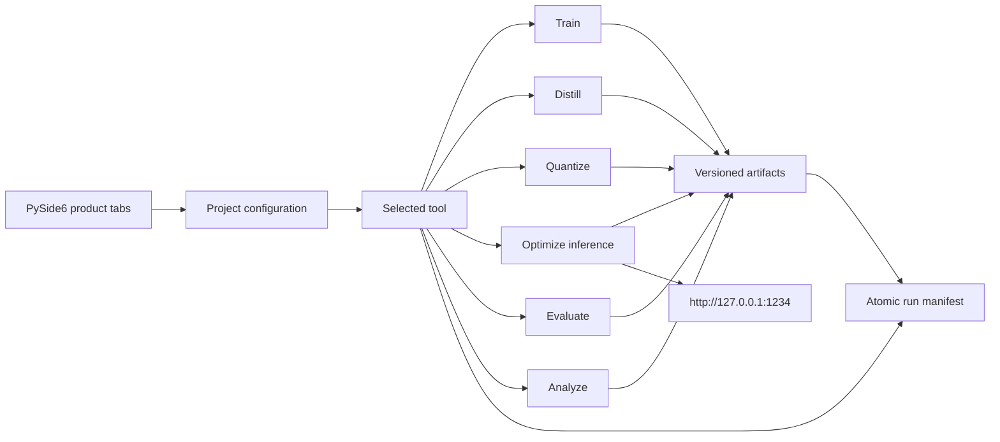

# Architecture

Inferna separates product configuration from execution. Each tool has its own typed settings and
can be run on its own. A run writes artifacts and an atomic manifest for that tool only.

```mermaid
flowchart LR
    UI["PySide6 product tabs"] --> CFG["Project configuration"]
    CFG --> ACT["Selected tool"]
    ACT --> TRAIN["Train"]
    ACT --> KD["Distill"]
    ACT --> Q["Quantize"]
    ACT --> OPT["Optimize inference"]
    ACT --> EVAL["Evaluate"]
    ACT --> ANA["Analyze"]
    TRAIN --> ART["Versioned artifacts"]
    KD --> ART
    Q --> ART
    OPT --> ART
    OPT --> SERVE["http://127.0.0.1:1234"]
    EVAL --> ART
    ANA --> ART
    ACT --> MAN["Atomic run manifest"]
    ART --> MAN
```

Tools share queued models and, when needed, the dataset on Data & Train. They do not wait on each
other. If you want a quantized model as inference input, queue that artifact as a local model and run
inference optimization.

## Artifact contracts

- `policy_model`: an inference-capable policy or adapter produced by training/distillation
- `reward_model`: a scalar reward checkpoint used by PPO-style training
- `eval_results`: structured benchmark results
- `analysis`: `representations.json` with layer points, metrics, and CKA matrix
- `deployment_model`: a target-specific compressed artifact directory
- `inference_engine`: a validated serve/compile plan (`inference_plan.json`) plus an optional compiled engine and `device_bind` probe. Target `auto` is resolved at run time to the highest-ranked specialist that is present and artifact-ready. After load (or after optimize) Inferna binds that recipe at `http://127.0.0.1:1234`. Skipping optimize uses a portable CPU recipe on the same port.
- `distillation_manifest`: teacher/data-generation provenance

## Reliability boundaries

- Config, result, analysis, and manifest JSON use atomic replace writes.
- Untrusted model names and repository IDs are converted into collision-resistant, non-traversing path
  components.
- Worker code depends on core model validation, never Qt UI modules.
- Subprocesses use argument arrays with `shell=False`; tool settings are never interpolated into
  shell strings.
- Cancellation is checked before a tool starts. Trainer-level cooperative cancellation and resumable
  distributed checkpoints remain future work.
- Run manifests are local provenance records, not a substitute for an external experiment tracker,
  artifact registry, access-control service, or audit-log sink.
- Windows packaging is native-architecture only. `scripts/build_windows.ps1` freezes the host
  (x64 or ARM64) with PyInstaller and compiles `Inferna-Setup-<arch>.exe`. A universal installer
  is a picker over both payloads, not a cross-compiled binary. 32-bit Windows is rejected.
